# Problem Formulation

Our objective is to use a GAN to both provide high quality samples for training downstream models while simultaneously abstracting away from the original patients used to train the model. Overall, this objective consists of two competing tasks which we will attempt to effectively measure in our experiments:
- We want to make the original dataset private. These ideas are explored in the literature and are primarily referred to as differential privacy. One of the main objectives in the privacy literature is that an adversary is unable to recover an original training sample only from the model’s parameters or outputs (sometimes called a Membership Inference Attack-MIA).

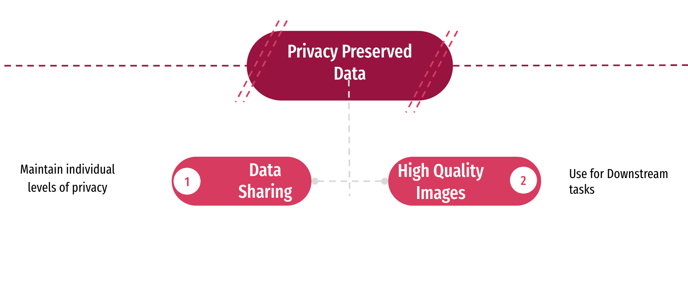

- We want to generate quality data which represents the underlying distribution. We need to strike a balance between releasing individual patient data and creating useful medical applications. In theory, we would want to measure how close our GANs output distribution matches with the true distribution. This is unfeasible not only because we don’t have access to the true distribution, but also because GANs are an implicit density estimator. Practically, we will likely rate how the GANs training data is able to improve the performance on a downstream task utilizing the generated data.

# Input and Output

We explored medical datasets like ImageCLEF Radiology Image dataset (4000 training images, 500 Validation images, 500 test set images), and STARE retinal image dataset. The models were trained on the ImageCLEF Radiology images, the results are near to the original scans, we can’t really comprehend or evaluate the results obtained. So, we went ahead with using celebA dataset to generate a new celebrity dataset and measure privacy.
As the outcome of the project, we will analyze the privacy concerns associated with releasing a dataset by inculcating measures like Maximum mean discrepancy(MMD), Nearest Neighbors etc.

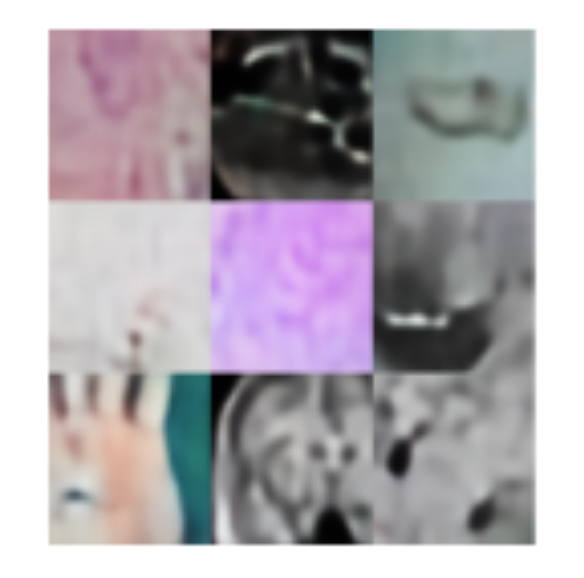


# Models and Experimentation

## Data Generation Phase

Firstly, we trained a Gaussian to understand the divergence between the distributions. We explored different GAN’s like DCGAN( Linear Layers & Conv Layer Architectures), WGAN with Fully Connected Generator and Convoluted WGAN with Gradient Penalty for different Hyperparameter settings.

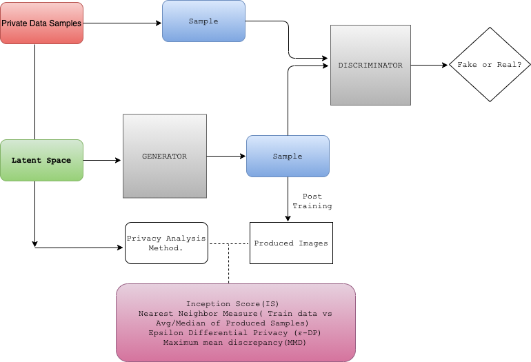

## Models

### Gaussians

We experimented with some much simpler low dimensional variables to get a richer understanding of the trade-off between sample quality, distribution understanding, and privacy protection. In many cases, having generated the underlying training data, we have access to a pure measure of performance in terms of the distance from the true distribution. This helps ground our understanding of performance relative to the amount of privacy gained by a numerical model like differential privacy. We trained both standard GANs and WGANs on these simple datasets to find the model with the best performance on these simpler datasets.
In the following, we can see the performance of a GAN on fitting an extremely simple two-dimensional Gaussian variable with 2000 training samples.


### Simple Gaussian

#### Unimodal Distribution
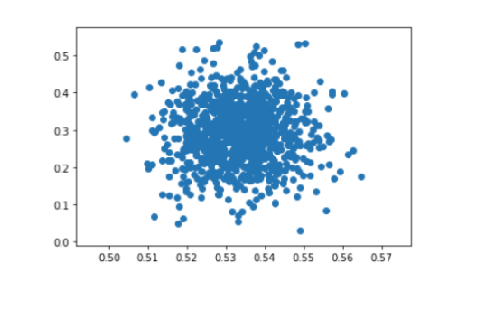

#### After Epoch 300 and 1000
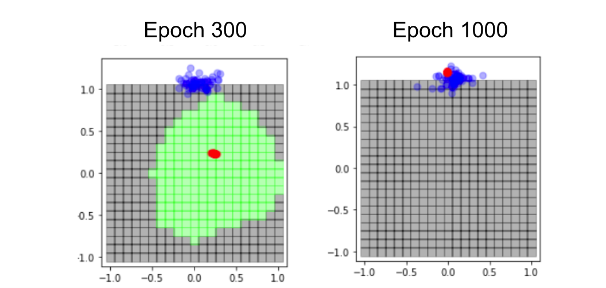

### Multimodal Gaussian

#### Multimodal Distribution
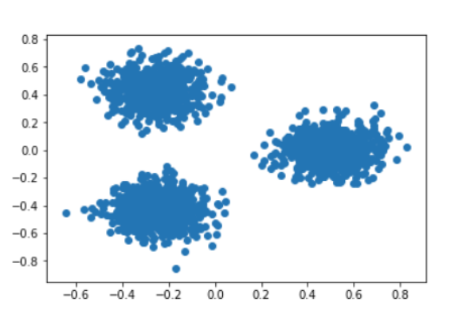

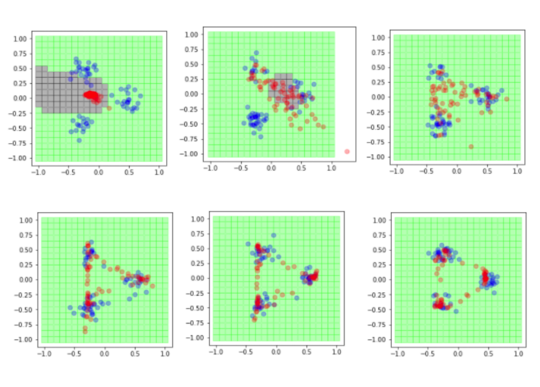

#### Gaussian Mixture Generator and Discriminator Loss

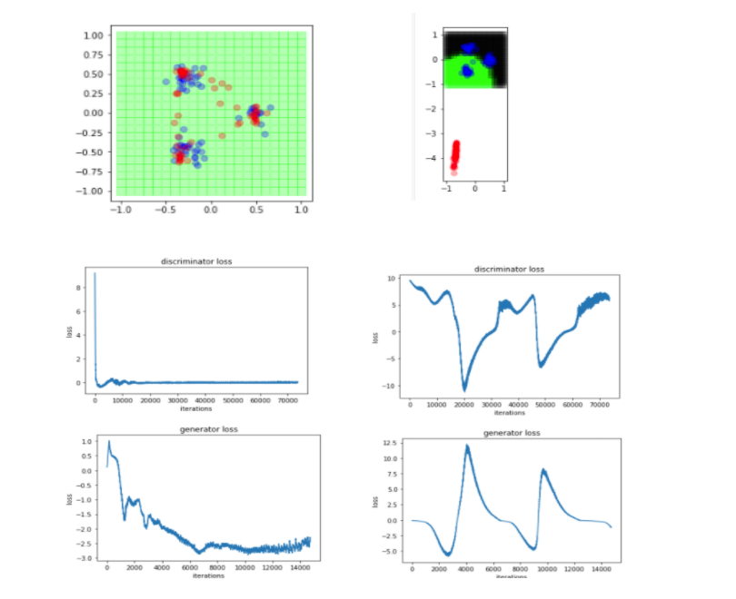


### DCGAN

DCGAN with Convolution Architecture produced better images compared to that of DCGAN with Linear Layers with the CelebA dataset. However, it suffered from the mode collapse. And the overall quality of the images wasn’t that clear for the CelebA dataset. So, we explored other GAN models.
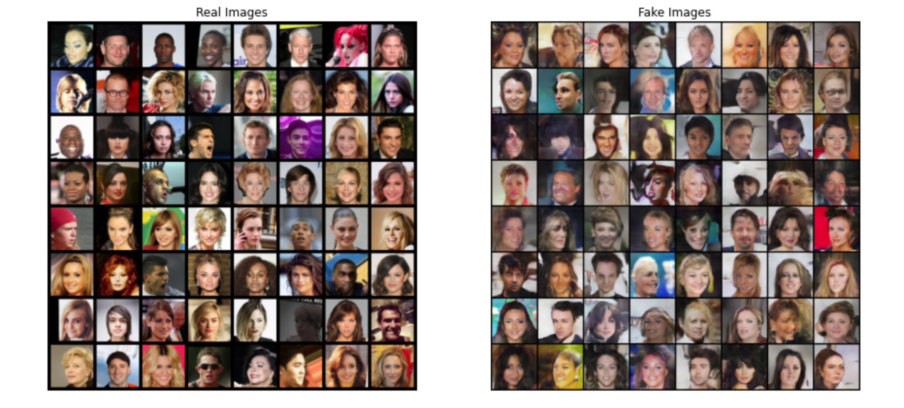

### WGAN - Fully Connected Generator

Loss measure used in DCGAN is susceptible to mode collapse. Taking this into consideration, WGAN uses Wasserstein distance (distance function defined between probability distributions on a given metric space) as a loss measure for smoother gradients and this loss function is immune to mode collapse.
In this model, we use linear or fully-connected layers in the generator and discriminator architecture. We use the Earth Mover distance or Wasserstein distance for the loss function with gradient clipping to achieve 1-lipschitz constraint

### Convoluted WGAN with Gradient Penalty

Similar to the above GAN, this model uses Wasserstein distance as a loss measure, but to enforce Lipschitz constraint, we use gradient norm as a penalty to clip the gradients. Furthermore, in this model we use convoluted layers instead of linear layers in the generator and discriminator model.
The **network architecture** is as follows :

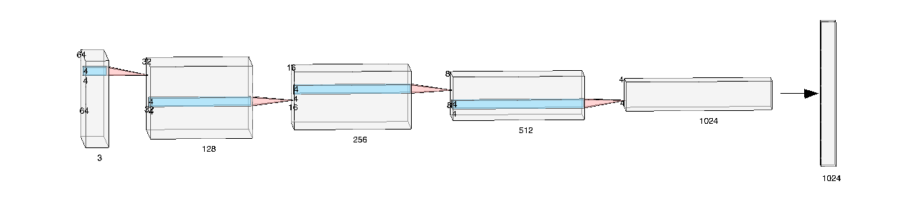

##### Training Images

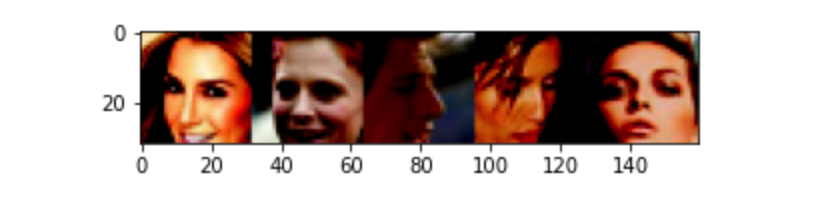

##### Generated Images

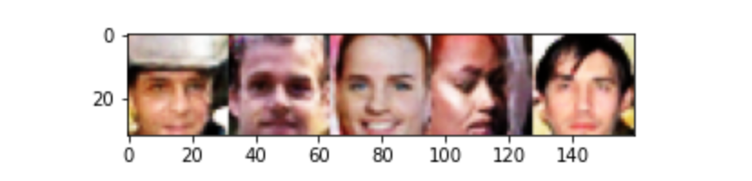

As it can be seen here, the quality of the images produced are much better.

# Privacy Analysis

## Nearest Neighbors Analysis

We have calculated the nearest neighbors matrix for each of the generated images(approx 6400 images) with a random batch of images from the training set. Then, picked the image with the min distance between those training and generated images. We explored different distance metrics like Cosine Distance, Euclidean distance and Mahalanobis distance.

#### Cosine Distance
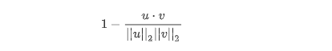

#### Mahalnobis Distance
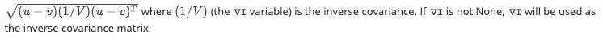

As it can be seen,**this serves as one of the metric show that GAN is not actually spitting out the actual training images** , and is able to capture features like Rotation, orientation, flips etc., But given the high dimension of the data, this is suffering from the curse of dimensionality, for the large number of comparison, most of the images is close to one specific image.
As a result, we are considering to use auto encoder on both of these batches of data, calculate the latent representation (reducing the dimension), then calculating the distance matrix between these two batches.

#### Generated Samples
##### Sample 1

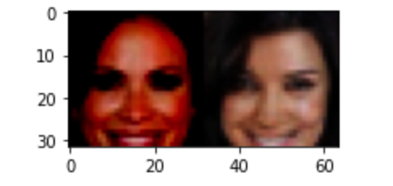

##### Sample 2

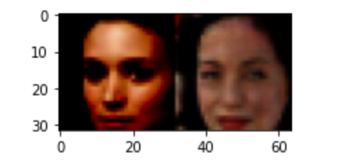

## Maximum Mean Discrepancy

We used AutoEncoder on both the training image batch and generated image batch. These latent feature map, is used to map to reproducing kernel Hilbert space .These are spaces of functions, and satisfy a key property (called the reproducing property). Generated intermediate latent variable is to calculate the maximum Mean Discrepancy between two latent representation of those batches. Two distributions are similar if their moments are similar. In the latent space we can compute the difference between the moments and average it. This gives a measure of the similarity/dissimilarity between the datasets. We got a MMD value of about 0.008.

```python
def max_mean_discrepancy(x, y, B, alpha):
  xx, yy, zz = torch.mm(x,x.t()), torch.mm(y,y.t()), torch.mm(x,y.t())
  rx = (xx.diag().unsqueeze(0).expand_as(xx))
  ry = (yy.diag().unsqueeze(0).expand_as(yy))

  K = torch.exp(- alpha * (rx.t() + rx - 2*xx))
  L = torch.exp(- alpha * (ry.t() + ry - 2*yy))
  P = torch.exp(- alpha * (rx.t() + ry - 2*zz))

  beta = (1./(B*(B-1)))
  gamma = (2./(B*B)) 

  mmd =  beta * (torch.sum(K)+torch.sum(L)) - gamma * torch.sum(P)
  return mmd
```

## Evaluation Experiments: Quantitative/qualitative measures to evaluate results.

A good measure of a how well a GAN generates privacy preserved dataset would be evaluated against:
- Performance of the GAN : Measure of the quality of generated data, typically evaluated by computing the Inception Score(IS), which in turn computes the KL Divergence between the generated data distribution and the training data distribution.
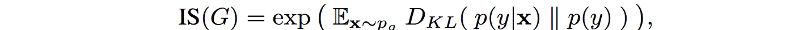

- Epsilon Differential Privacy (ε-DP) : Measure of level of privacy guarantee achieved by a model. A randomized algorithm φ is said to provide ε-differential privacy if, for all datasets d and d’,such that the d and d’ differ by one element(add/remove one entry in the dataset)
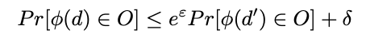

- Maximum mean discrepancy(MMD) : The idea of representing distances between distributions as distances between mean embeddings of features. That is, say we have distributions P and Q, then the MMD will be:
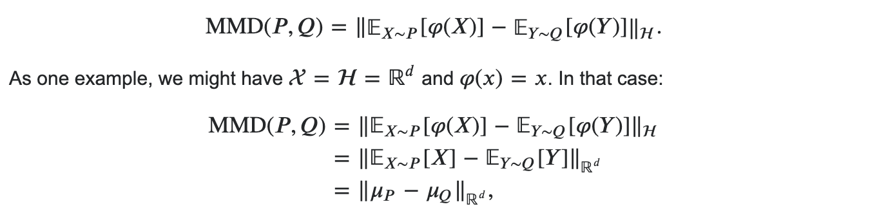

# Privacy v/s Quality

## Tradeoff between Privacy and Quality

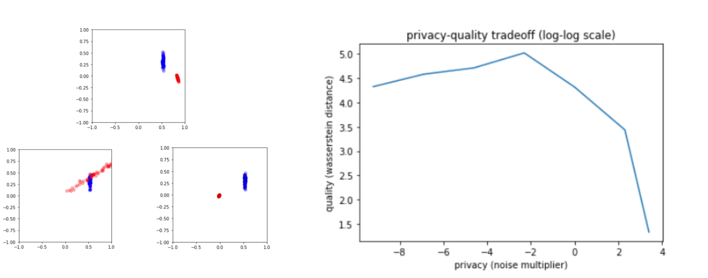
We need to strike the right balance between the quality and privacy. As the noise multiplier increases, quality of the images becomes much worse. As seen from the graph, there is a peak at which the distance is high ( privacy is preserved) and quality of the images generated is better.

## Logscale Privacy v/s Quality
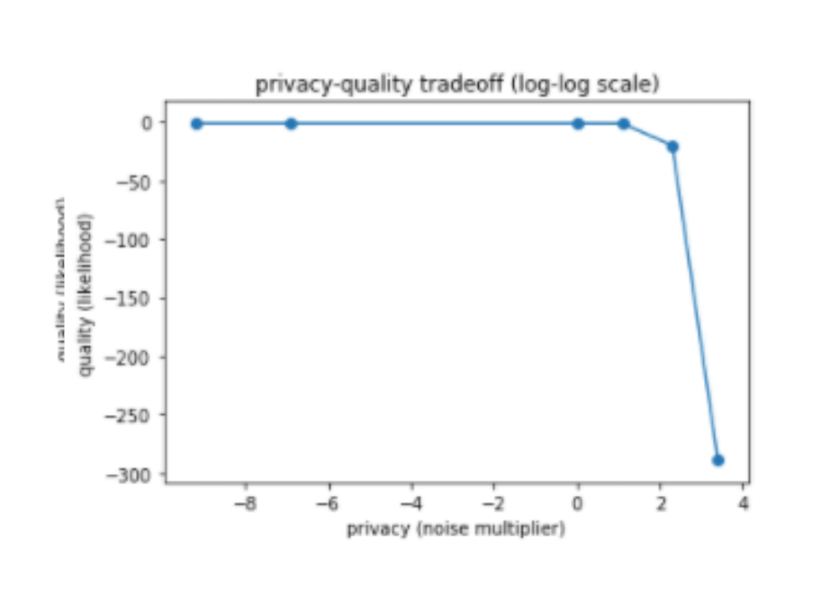
There is no longer the exact Wasserstein distance because it is intractable to compute. Rather, it is the sampled likelihood value (since training distribution is still known, but generated distribution is unknown).

## High Noise v/s Low Noise
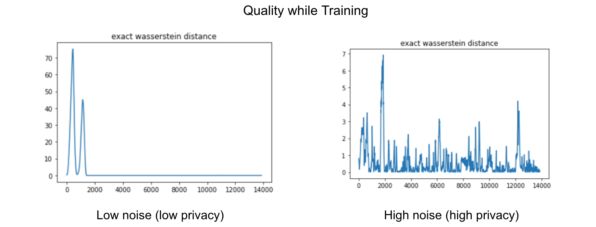
When the noise is low, distance is less, so compromises on the privacy. As the noise increases, as we can see from the graph, the spikes indicates it is not same the training data and is inaccessible to the underlying distribution. We have used noise as the proxy to measure the privacy.

# Conclusions

- Privacy can be preserved - using noise/ gradient penalty, making it inaccessible to the original data.
- We have to find the noise such that we strike a good balance between the quality and also the privacy.


- As seen from this graphs, if we add too much noise, quality deteriorates.
Below is an example of Quality of Results using WGAN with different noise values.
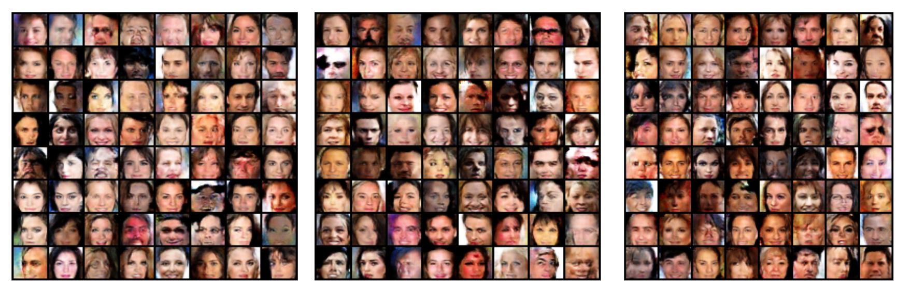


